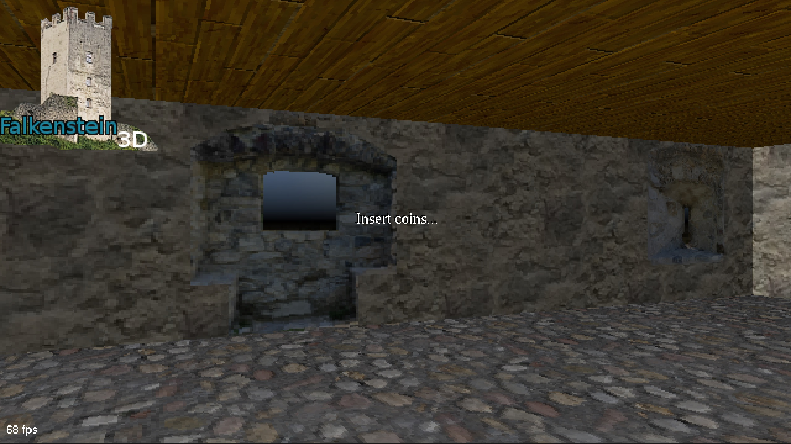
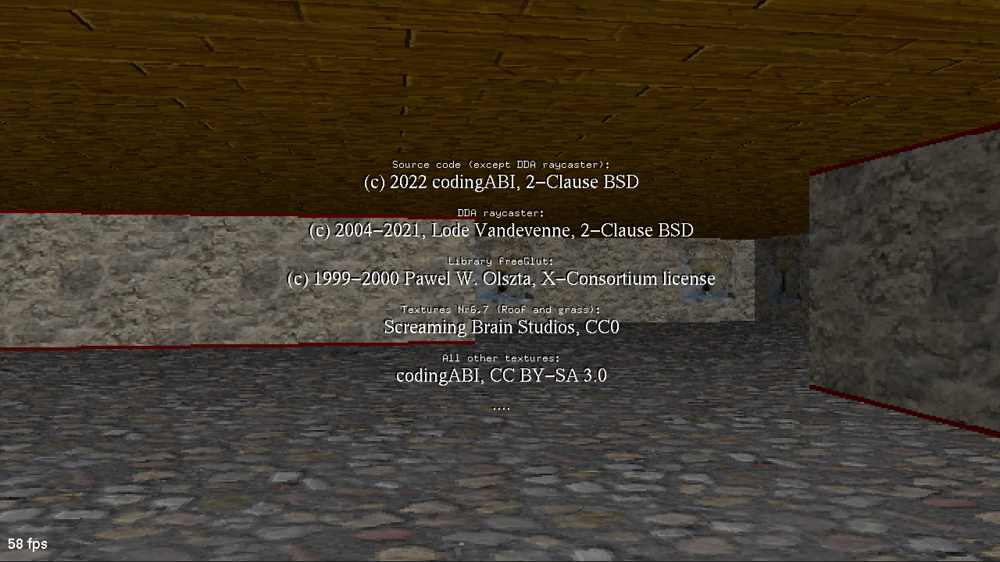
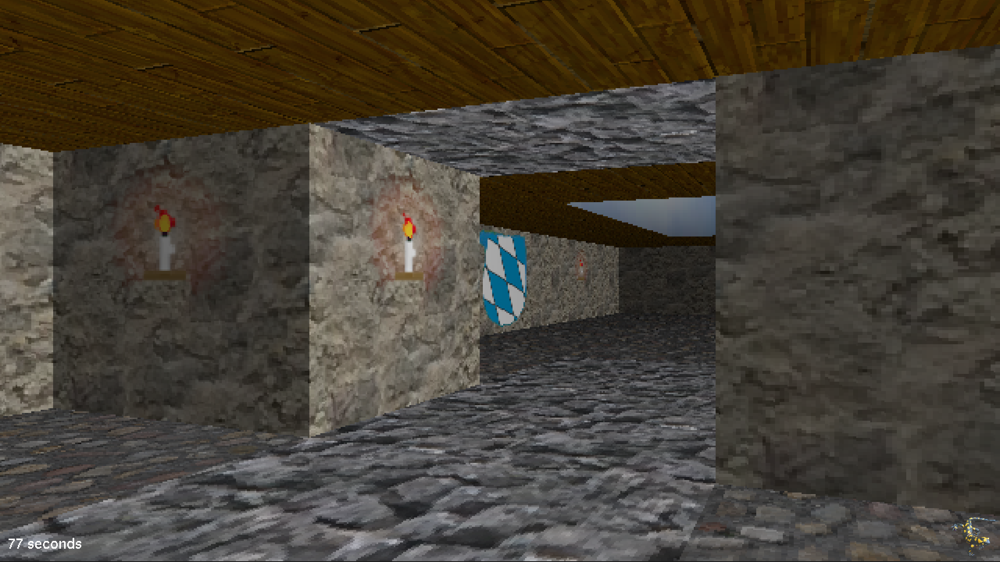

# Falkenstein3D

OpenGL raycaster game. Player has to find the exit of the castle. Game is short and has only one level. It is more a technical demo than a real long game.

This project uses two different raycaster engines, which can be select by pressing Key "3":
- Degree based raycaster by codingABI, inspired by https://github.com/3DSage/OpenGL-Raycaster_v1 and https://github.com/3DSage/OpenGL-Raycaster_v2
- DDA Raycaster by Lode Vandevenne (see [license details](#license-and-copyright) below), faster and used by default

## Keyboard control:
- s/S = Change pixel size (impacts performance)
- 1 = on/off for textures for floor and roof
- 2 = on/off for floor, roof, sky and ground
- 3 = change raycaster engine (old from codingABI <-> DDA from Lode Vandevenne) 
- 4 = on/off for round pixels
- 5 = on/off for automatically set pixel size dependent on framerate
- t/T = on/off for all textures
- f/F = on/off for fullscreen mode
- ESC,q,Q = exit program
- Cursor left/right = rotate player
- Cursor up/down = move player forward/backward

## Joystick control:
- left/right - rotate player
- up/down - move player forward/backward
 
## Mouse control:
- left/right mouse button - rotate player
- middle mouse button - move player forward
- scroll button backward - move player backward

## Screenshots

We need no "coins". Just press any key to start the game...

## License and copyright

This code for this project is licensed under the terms of the 2-Clause BSD License from two owners:

- Source code (except DDA raycaster functions): [Copyright (c) 2022 codingABI](LICENSE.md)
- DDA raycaster functions (drawRaycastDDA, drawBackground, sortSprites and drawSprites): [Copyright (c) 2004-2021, Lode Vandevenne](LICENSE.DDA)

This project uses the external Libraries:
- freeGlut [Copyright (c) 1999-2000 Pawel W. Olszta, X-Consortium license](LICENSE.freeGlut)

The textures for this project are licensed:
- Textures Nr6, 7: Screaming Brain Studios, CC0 
- All other textures: [Copyright (c) 2022 codingABI, CC BY-SA 3.0](LICENSE.CC-BY-SA-3.0)
